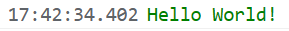
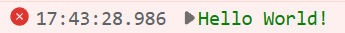
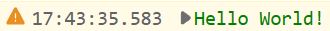

# console log

console

  


***
## 输入类型
String | any


***
## 效果展示
  
  
  


***
## 源码
```js title="/categorys/debug.js"
    {//2.0.1
        opcode: `${category_id}.console`,
        messageId: `${category_id}.console`,
        categoryId: category_id,
        type: type.BlockType.COMMAND,
        param: {
            type: {
                type: type.ParameterType.STRING,
                default: 'log',
                menu: make_menus(
                    `${category_id}.console.menu`,
                    'log',
                    'error',
                    'debug',
                    'info',
                    'warn'
                )
            },
            v: {
                type: type.ParameterType.STRING,
                default: '"%cHello World!","color: green"'
            }
        },
        function: (args,util)=>{
            if( ![
              'log',
              'error',
              'debug',
              'info',
              'warn'
            ].includes( args.type ) ){
                return
            }

            let v = args.v;
            if( typeof v !== 'object' ){
                try{
                    v = JSON.parse(`[${v}]`);
                    console[ args.type ]( ...v );
                    return;
                }catch{}
            }
            console[ args.type ]( v );
        }
    },
```
